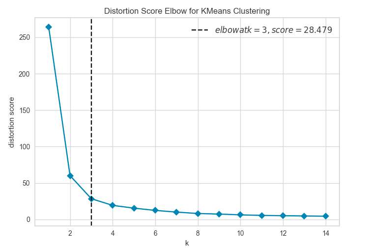

# ACM Research Coding Challenge (Fall 2020)

## No Collaboration Policy

**You may not collaborate with anyone on this challenge.** You _are_ allowed to use Internet documentation. If you _do_ use existing code (either from Github, Stack Overflow, or other sources), **please cite your sources in the README**.

## Submission Procedure

Please follow the below instructions on how to submit your answers.

1. Create a **public** fork of this repo and name it `ACM-Research-Coding-Challenge`. To fork this repo, click the button on the top right and click the "Fork" button.
2. Clone the fork of the repo to your computer using . `git clone [the URL of your clone]`. You may need to install Git for this (Google it).
3. Complete the Challenge based on the instructions below.
4. Email the link of your repo to research@acmutd.co with the same email you used to submit your application. Be sure to include your name in the email.

## Question One

 
Given the following dataset in `ClusterPlot.csv`, determine the number of clusters by using any clustering algorithm. **You're allowed to use any Python library you want to implement this**, just document which ones you used in this README file. Try to complete this as soon as possible.

Regardless if you can or cannot answer the question, provide a short explanation of how you got your solution or how you think it can be solved in your README.md file.

## How I got my solution and the libraries I used

Before I even started writing code, I did some research on different clustering algorithims. Through my research I learned one of the most popular clustering algorithims was KMeans and the way to find the number of clusters using KMeans was called the Elbow Method. I decided that I would use these two methods to find the number of clusters in the data I was given.

I first used the pandas and numpy libraries to convert the data from the .csv file to an array. I used the pandas library to bring the data into python from the .csv file and then used the numpy library to convert the data into an array. 

 
I then used the Elbow Method to find the number of clusters in the data. To use the Elbow Method I used the sklearn and yellowbrick libraries. I used the distortion version of the Elbow Method where the computer computes the sum of squared distances from each point to its assigned center through KMeans. I used the sklearn library while using KMeans. I then used the KElbowVisualizer from the yellowbrick library which created a graph of the distortion score. While looking at the graph the visualizer showed me that the distrotions started to have minimal changes after k = 3 indicating that the data had 3 clusters.

 
I then used the sklearn and matplotlib libraries to see what the graph would look with 3 clusters. I used the KMean algorithim through the sklearn library to find the points that would correspond to each cluster and then used the matplotlib library to pull up all of the data on a graph to see which points belonged to which clusters.
